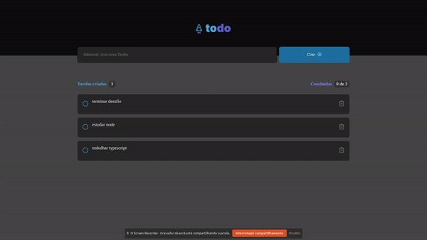

<h1 align="center"> To-Do App </h1>

    Challenge do modulo 1 da Especialização de ReactJs atualização 2022

<h1 align="center">
    
</h1>

  <a href="#-tecnologias">Tecnologias</a>&nbsp;&nbsp;&nbsp;|&nbsp;&nbsp;&nbsp;
  <a href="#-projeto">Projeto</a>&nbsp;&nbsp;&nbsp;|&nbsp;&nbsp;&nbsp;
  <a href="#-layout">Layout</a>&nbsp;&nbsp;&nbsp;|&nbsp;&nbsp;&nbsp;
  <a href="#memo-licença">Licença</a>

  

 

## 🚀 Tecnologias

Esse projeto foi desenvolvido com as seguintes tecnologias:

- [React](https://reactjs.org)
- [TypeScript](https://www.typescriptlang.org/)
- [CssModules](https://github.com/css-modules/css-modules)
- [Vite](https://vitejs.dev/)

## 💻 Projeto
Projeto para Pratica dos conceitos do modulo 1 da Especialização em ReactJS

- Adicionar uma nova tarefa
- Marcar e desmarcar uma tarefa como concluída
- Remover uma tarefa da listagem
- Mostrar o progresso de conclusão das tarefas

Apesar de serem poucas funcionalidades, você vai precisar relembrar conceitos como:

- Estados
- Imutabilidade do estado
- Listas e chaves no ReactJS
- Propriedades
- Consonantização

Para rodar clone o repositório  `git clone git@github.com:DouglasO-R/to-do-app.git`, acesse a pasta do web `cd to-do-app`, instale as dependências `yarn`, e rode o app com `yarn dev` 

## 🔖 Layout

Nos links abaixo você encontra o layout do projeto web e também do mobile. Lembrando que você precisa ter uma conta no [Figma](http://figma.com/) para acessá-lo.

- [Layout Web/Mobile](https://www.figma.com/file/NioO8FdYG3XpiQ018zSp8t/ToDo-List-(Copy))

## :memo: Licença

Esse projeto está sob a licença MIT.

